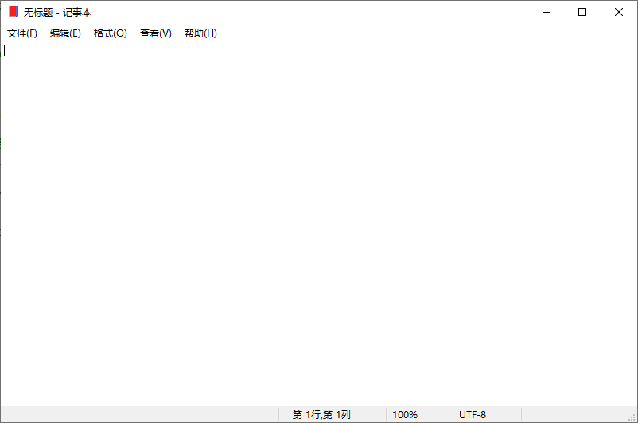
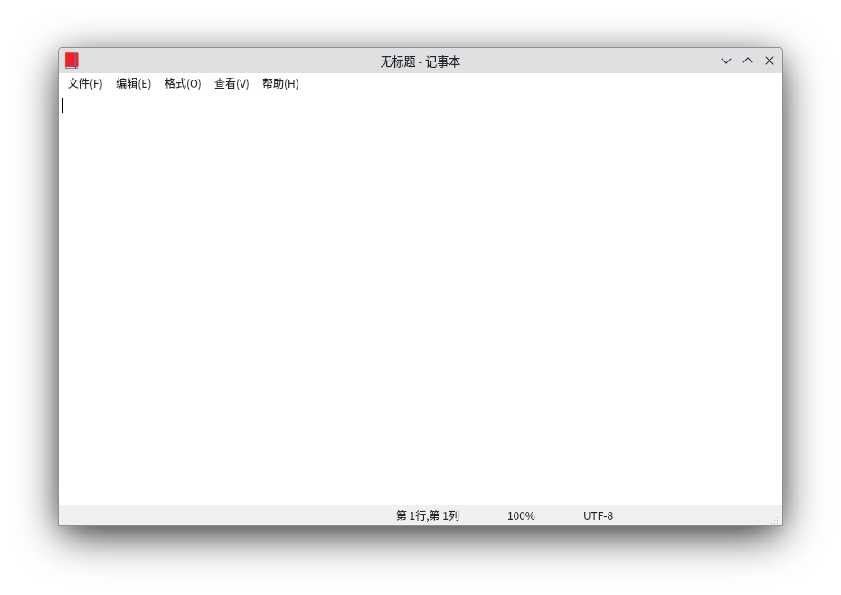
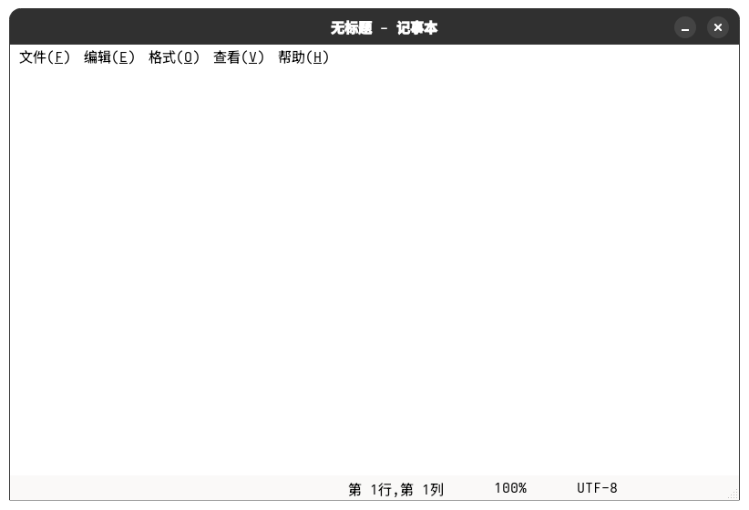
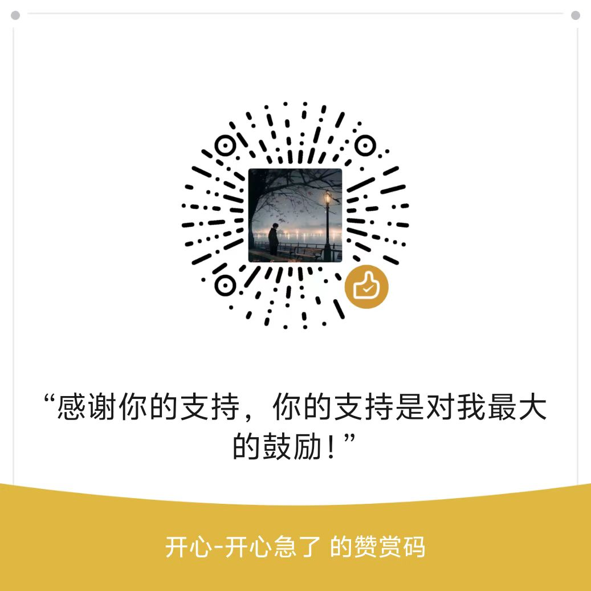

# PySide6 记事本 (PySide6NotePad)

<<<<<<< HEAD
  
  
  
=======
  
  
  
>>>>>>> b1ef395beb9653e9af3bad0a898b36476f928143

 win10,Kubuntu24X11,fedora43 macOS(条件有限不支持)

[](https://www.python.org/)
[](LICENSE)
[]

一款使用PySide6 实现的win10风格的跨平台记事本应用。
 
本项目是基于PySide 6技术开发的“模仿性学习”实践案例——初衷就是让刚接触PySide 6的小伙伴，通过模仿Windows系统原生记事本的功能开发，直观掌握PySide 6 GUI开发的核心逻辑、控件使用与交互实现技巧。虽主要聚焦PySide 6，但项目中涉及的多数开发逻辑与PyQt兼容，PyQt学习者也能参考使用。
 
目前项目会持续维护win10记事本基础功能，确保模仿学习的核心案例稳定可用；同时会重点围绕“模仿性学习”优化：比如补充PySide 6相关的详细代码注释、整理模仿开发过程中的常见问题解决方案、录制针对新手的模仿开发拆解视频等。

# 如何运行
建议使用[uv](https://uv.doczh.com/)工具

## 克隆项目
```bash
git clone https://github.com/BasterHapy/PySide6NotePad.git
```

## 进入目录文件夹
```bash
cd PySide6NotePad
```
## 创建虚拟机环境
```bash
uv venv pyside6_venv -p 3.11
```
## 安装Python依赖
```bash
uv pip install -r requirements.txt
```
## 运行
```bash
python main.py
```

# 捐赠
 
如果您选择捐赠，所有资金将主要用于以下方向，进一步强化模仿学习支持：

1. 细化PySide 6代码注释与开发文档，清晰标注“模仿原生功能时的代码设计思路”，让新手看懂模仿开发的逻辑关联

2. 制作PySide 6模仿开发教程视频，从“分析原生记事本功能”到“用PySide 6实现”逐步讲解；

3. 后续拓展win11记事本等同类模仿性开发项目，为新手提供更多贴近系统原生工具的PySide 6实践案例。
 
> 无论捐赠金额大小，都将是我持续打磨PySide 6模仿学习型开源项目的重要动力。我会定期在项目仓库中公开捐赠收支及使用情况，确保每一份支持都能实实在在地助力PySide 6新手通过模仿快速入门。

  
  

再次感谢您的信任与支持！

## 许可证
本项目采用 GNU GPL v3 许可证；详见 [LICENSE](./LICENSE) 文件。
